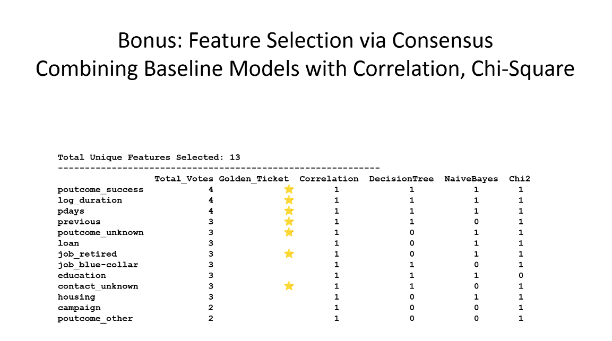
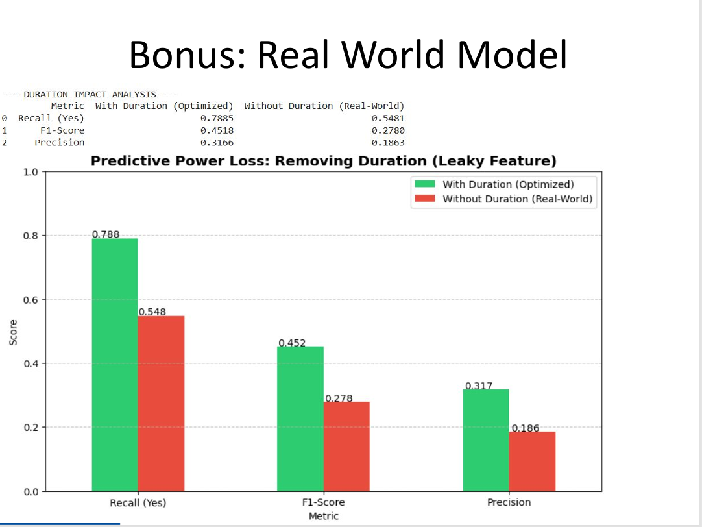
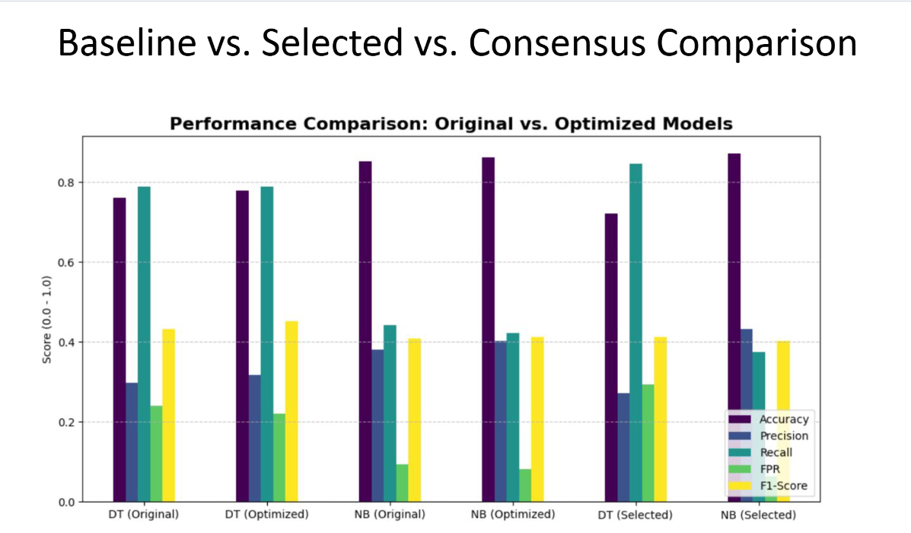
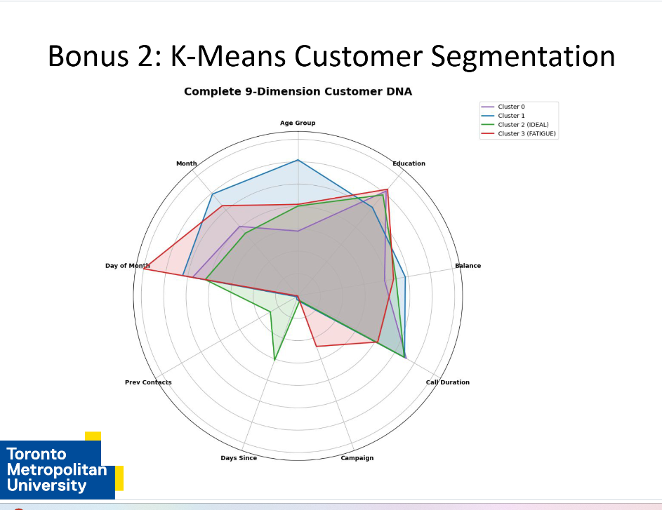

# Predictive Analytics Portfolio

---

# CIND119 — Introduction to Big Data Analytics
**Toronto Metropolitan University** · Winter 2025

> An introduction to big data concepts and machine learning methods, covering unsupervised clustering, supervised classification, and database querying applied to real-world datasets.

---

## 🛠 Skills & Tools
**Languages:** Python, SAS, SQL  
**Libraries:** Pandas, NumPy, Scikit-learn, PandasSQL, Matplotlib, Seaborn  
**Techniques:** K-Means Clustering, Predictive Modeling (Decision Trees, Naïve Bayes), Feature Engineering, EDA, SQL Querying  
**Software:** Jupyter Notebook, SAS Studio, SQLite Studio

---

## 📂 Featured Projects

## Group Project: Bank Telemarketing Subscription Prediction

**Overview:** Built a full machine learning pipeline on a Portuguese bank's telemarketing dataset (4,521 records, 17 attributes) to identify customers most likely to subscribe to a long-term deposit product — supporting a data-driven shift away from broad, untargeted phone campaigns.

The dataset presented a significant class imbalance (88.5% non-subscribers vs. 11.5% subscribers), making accuracy an unreliable primary metric and elevating recall and false positive rate as the key evaluation criteria. Missing values were handled through cross-attribute frequency imputation, financial variables were log-transformed to satisfy Gaussian assumptions for Naïve Bayes, and nominal attributes were one-hot encoded to prevent false ordinal relationships.

Six models were trained and compared across three feature strategies — full feature set (29 features), DT-selected (13), and a 4-method consensus set (13 features validated across correlation, Decision Tree Gini importance, Naïve Bayes permutation importance, and Chi-Square). 

  
   <em>Figure 1: 4-Method Consensus Feature Selection (The Golden Ticket)</em>

A reverse-causality stress test was conducted by removing call duration from the model — confirming it as a leaky pre-call feature — with recall dropping from 78.85% to 54.81% in the duration-excluded configuration.

> **Insight:** Including `duration` creates an artificially high performance because it is a "leaky" feature. Our stress test showed that while the model looks better with it, a real-world predictive model (duration-excluded) drops in recall from 78.85% to 54.81%.

  
   <em>Figure 2: Impact of removing "Leaky" Call Duration on Model Recall</em>

A supplementary K-Means segmentation (k=4, 9 features) produced four actionable customer personas, with Cluster 2 identified as the primary target group at a 19.6% subscription rate, and Cluster 3 flagged for campaign cessation due to a 3.0% success rate and average of 12.8 prior contact attempts.

**Tech stack:** Python (Pandas, NumPy, Scikit-learn, Matplotlib, Seaborn), SQL (pandasql), Jupyter Notebook

**My contribution:** Predictive modelling pipeline, 4-method consensus feature selection system, reverse-causality stress test, K-Means segmentation, report authoring.

> **Key Result:** The **Optimized Decision Tree** (using the 13-feature consensus set) achieved the best balance of performance, specifically improving the **F1-Score to 0.4518** and maintaining a high **Recall (78.85%)**.

  
  
   
  <em>Figure 3 & 4: Model Comparison across metrics (Left) | Cluster 2 Ideal Customer Persona (Right)</em>

---

## Project Deliverables:
* [🐍 View Jupyter Notebook](./CIND119/CIND119_Bank_Project/CIND119_Final_Project_Notebook.ipynb)
* [📊 View Final Presentation (PDF)](./CIND119/CIND119_Bank_Project/Bank_Final_Presentation.pdf)

---

### [Assignment 1: K-Means Cluster Analysis](./CIND119/CIND119%20A1/Cind119_A1_Report.pdf)

**Overview:** Applied unsupervised machine learning to a clinical cardiovascular dataset containing 13 patient attributes to identify natural groupings without relying on known diagnoses. Imported and explored the data in SAS, performed descriptive statistics, and standardized numerical features before clustering. Ran K-Means across four configurations (k=2 through k=5) using SAS's FASTCLUS procedure, evaluated each solution using RMS Standard Deviation, and selected the optimal cluster count based on that metric. Visualized cluster assignments against the original diagnostic labels using cholesterol vs. age scatter plots to assess separation quality.

**Tech stack:** SAS (PROC IMPORT, PROC MEANS, PROC STDIZE, FASTCLUS)

**Key result:** Identified the optimal k value through systematic evaluation, with cluster visualizations revealing distinguishable patient groupings along age and cholesterol dimensions.

---

### [Assignment 2: Retail Inventory Querying](./CIND119/CIND119%20A2/Assignment_2_CIND119_CarlosElizondo.pdf)

**Overview:** Designed and populated a relational database from scratch in SQLite Studio using a 15-record retail product dataset spanning five product categories. Wrote and executed five SQL queries addressing practical business questions — including category-level filtering, average price calculation, quantity-based selection, and total revenue aggregation per category. Focused on translating raw transactional data into structured, queryable intelligence using standard SQL operations.

**Tech stack:** SQLite, SQLite Studio, SQL (SELECT, WHERE, GROUP BY, aggregate functions)

**Key result:** Demonstrated end-to-end database setup and querying workflow, computing per-category revenue and surfacing pricing and inventory patterns across product lines.

---

## ⚠️ Limitations & Future Work

- Class imbalance (88.5% / 11.5%) constrains model precision; future cycles should explore SMOTE or cost-sensitive learning to improve minority-class detection.
- The K-Means segmentation is based on a single Portuguese bank dataset from one campaign period — persona profiles may not generalize across markets or time periods.
- The duration-excluded real-world model shows meaningful performance degradation, indicating a need for richer pre-call behavioural features in future data collection.

---

## 🤝 Contributing & License

Suggestions and feedback welcome — open an issue or pull request.

Licensed under the [MIT License](LICENSE).
